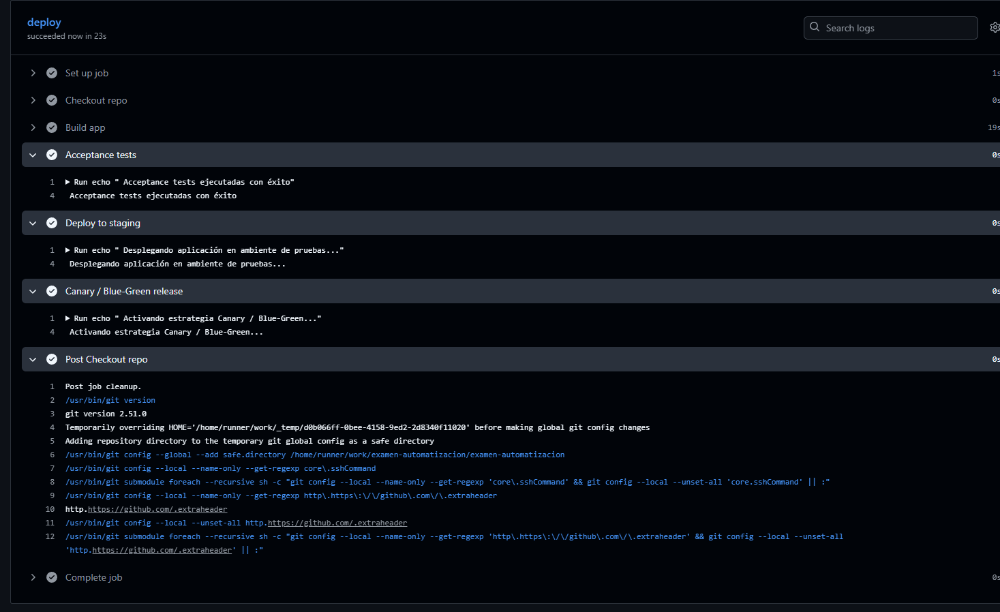
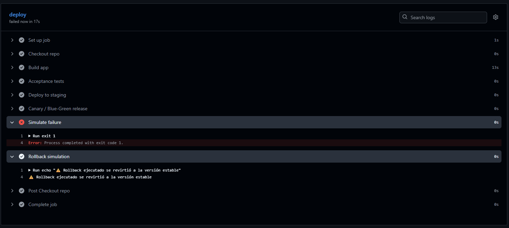
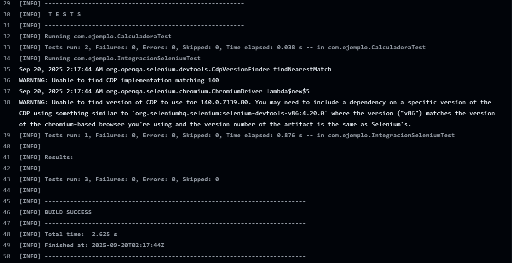

# Examen Automatizacion - CI con Maven y Github Actions

## Descripcion
Este proyecto implementa un flujo de **Integracion Continua (CI)** con Maven y Github Actions.
Incluye pruebas **unitarias** (JUnit) y de **integracion** (Selenium), ademas de la configuracion del pipeline en Github.
 --- 
## Tecnologias utilizadas
 - **Java 17**
 - **Maven 3.9.11**
 - **JUnit 5** - pruebas unitarias
 - **Selenium 4** - pruebas de integracion (headless en CI)
 - **Github Actions** - pipeline CI

 ---
## Estrategias de pruebas
 - **Pruebas unitarias:** validan operaciones basicas de la clase 'Calculadora'('CalculadoraTest')
 - **Pruebas de integracion:** verifican interaccion real con navegador usando Selenium ('IntegracionSeleniumTest').
 - Ambas pruebas se ejecutan automaticamente en cada *push* o *pull request*

## Ejecucion local
 1. Clonar el repo:
 ```bash
  git clone <url-repo>
  cd examen-automatizacion
 ```
 2. Ejecutar pruebas:
 ```bash
    mvn clean test
 ```

## Pipeline de Integracion (CI)
### Archivo: .github/workflows/ci.yml
El pipeline realiza:
1. Checkout del codigo.
2. Configuracion del JDK 17.
3. Build con Maven
4. Ejecucion de pruebas unitarias e integracion.
5. Publicacion de reportes Surefire como artefacto

## Pipeline de Despliegue (CD)
### Archivo: .github/workflows/deploy.yml
El pipeline de despliegue incluye:
1. Build del proyecto con Maven.
2. Pruebas de aceptación simuladas.
3. Despliegue en ambiente de pruebas (staging).
4. Estrategia Canary / Blue-Green (simulada).
5. Simulación de fallo y ejecución de rollback automático.

## Evidencias

### Deploy Exitoso

### Deploy Rollback

### CI Exitoso
